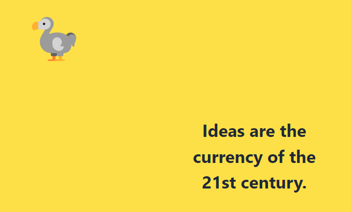
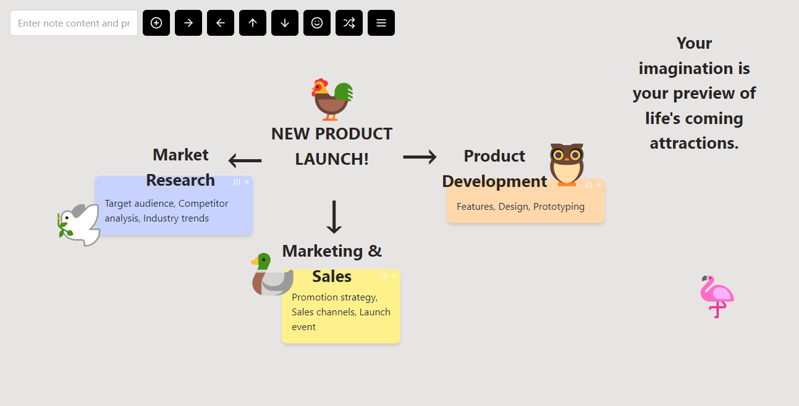
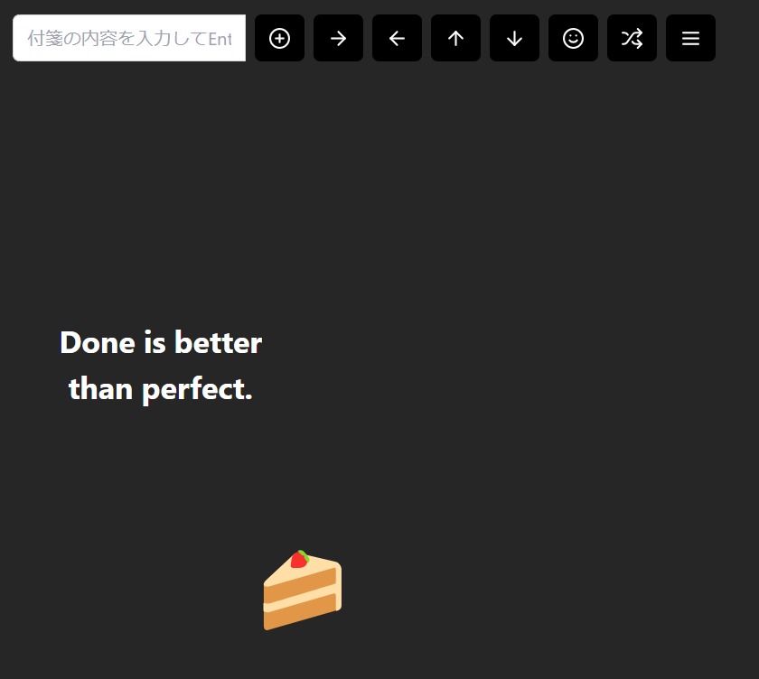
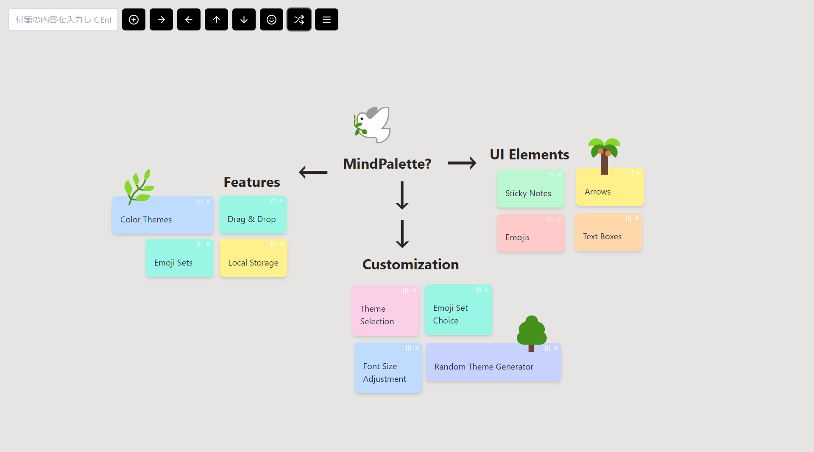
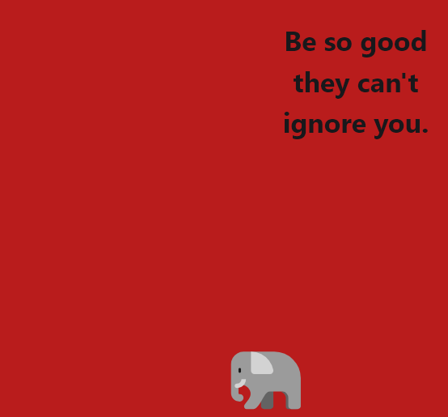
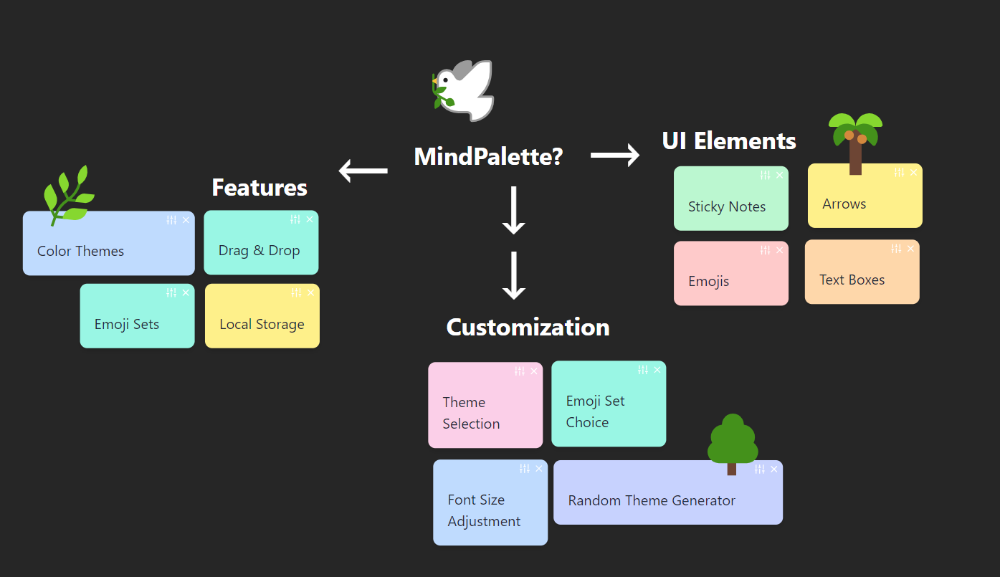

# 🎨 MindPalette

## 📖 Overview
MindPalette is a colorful and intuitive mind mapping tool designed to help you organize your thoughts and ideas.  Built with React.js and styled with Tailwind CSS, it offers various themes and emoji sets to stimulate your creativity and facilitate fun and effective thought visualization.

**[🎨 MindPalette🚀 https://230327tokiex.github.io/mindpalette-public/](https://230327tokiex.github.io/mindpalette-public/)**

## 🚀 Features
- 🖋 Simple and easy-to-use interface
- 🌈 Diverse color themes
- 😄 Extensive emoji sets
- 🔀 Random theme and emoji set functionality
- 💾 Local storage for data persistence
- 🎉 Welcoming interface with different motivational messages and emojis each time

## 🛠 How to Use
### Basic Operation
1. Open the app and you'll be greeted with a random motivational message and an emoji
2. Type your content into the text box and create a sticky note by pressing Enter or clicking the add button
3. Click the arrow buttons to add directional arrows
4. Click the emoji button to add a random emoji
5. Select a theme and emoji set from the settings menu
6. Use the shuffle button to randomly change the theme and emoji set

### Detailed Operation
- **Moving Elements**: All elements (sticky notes, arrows, emojis, and text) can be freely moved by dragging.
- **Sticky Note Operations**:
  - Resize: Click the "⚙️" icon in the upper right corner of a sticky note to resize it in three steps.
  - Change Color: Click a sticky note to randomly change its color.
  - Delete: Click the "×" icon in the upper right corner of a sticky note to delete it.
- **Arrow and Emoji Operations**:
  - Add: Click the corresponding button to add an arrow or emoji.
  - Delete: Double-click the element to delete it.
- **Text Operations**:
  - Add: Double-click anywhere on the board to add text.
  - Edit: Double-click the text to enter edit mode.
  - Delete: Delete the text content and confirm the edit to remove the text element.

  

## 💡 Concept
MindPalette aims to aid in idea organization and new idea generation by visually representing the thinking process with colors and shapes.  The colorful themes and diverse emoji sets allow for flexible customization to match the user's mood and task.

## 🎭 Emoji Sets
- nature
- fruits
- space
- travel
- sweets
- animals
- seaLife
- birds
- food
- smileys
- weather
- sports
- music

## 🌈 Themes
- default
- dark
- stone
- seaside
- ocean
- blackboard
- forest
- matcha
- sunflower
- latte
- sunset
- passion
- neon
- grape

## 📸 Screenshots

## 🛠 Tech Stack
- Front-end: React.js
- Styling: Tailwind CSS
- State Management: React Hooks
- Drag & Drop: react-draggable
- Icons: Lucide React

## 📅 Created
June 30, 2024

## 🤖 Development Support
This project was born from the developer's passion and built with the assistance of Claude 3.5 Sonnet by Anthropic and Gemini 1.5 Pro by Google.

## 📄 License
This project is licensed under the MIT License - see the [LICENSE](LICENSE) file for details.

# 🎨 MindPalette（日本語版README）

## 📖 概要
MindPaletteは、思考とアイデアを整理するためのカラフルで直感的なマインドマップツールです。React.jsを使用して開発され、Tailwind CSSでスタイリングされています。様々なテーマと絵文字セットを使用して、ユーザーの創造性を刺激し、楽しく効果的な思考の可視化を支援します。

**[🎨 MindPalette🚀 https://230327tokiex.github.io/mindpalette-public/](https://230327tokiex.github.io/mindpalette-public/)**

## 🚀 特徴
- 🖋 シンプルで使いやすいインターフェース
- 🌈 多彩なカラーテーマ
- 😄 豊富な絵文字セット
- 🔀 ランダムテーマ・絵文字セット機能
- 💾 ローカルストレージによるデータ保存
- 🎉 毎回異なるモチベーションメッセージと絵文字で歓迎

## 🛠 使い方
### 基本操作
1. アプリを開くと、ランダムなモチベーションメッセージと絵文字が表示されます
2. テキストボックスに内容を入力し、Enterキーまたは追加ボタンをクリックして付箋を作成
3. 矢印ボタンをクリックして方向矢印を追加
4. 絵文字ボタンをクリックしてランダムな絵文字を追加
5. 設定メニューからテーマと絵文字セットを選択
6. シャッフルボタンでテーマと絵文字セットをランダムに変更

### 詳細操作
- **全要素の移動**: すべての要素（付箋、矢印、絵文字、テキスト）はドラッグして自由に移動できます。
- **付箋の操作**:
  - サイズ変更: 付箋右上の「⚙️」アイコンをクリックすると、3段階でサイズを変更できます。
  - 色の変更: 付箋をクリックするとランダムで色が変更されます。
  - 削除: 付箋右上の「×」アイコンをクリックして削除します。
- **矢印・絵文字の操作**:
  - 追加: それぞれのボタンをクリックして追加します。
  - 削除: 要素をダブルクリックすると削除されます。
- **テキストの操作**:
  - 追加: ボード上の任意の位置でダブルクリックするとテキストを追加できます。
  - 編集: テキストをダブルクリックすると編集モードになります。
  - 削除: テキストを空にして編集を確定すると削除されます。

## 💡 コンセプト
MindPaletteは、思考のプロセスを色と形で表現することで、アイデアの整理と新しい発想の創出を支援します。カラフルなテーマと多様な絵文字セットにより、ユーザーの気分や作業内容に合わせて柔軟にカスタマイズできます。

## 🎭 絵文字セット
- nature
- fruits
- space
- travel
- sweets
- animals
- seaLife
- birds
- food
- smileys
- weather
- sports
- music

## 🌈 テーマ
- default
- dark
- stone
- seaside
- ocean
- blackboard
- forest
- matcha
- sunflower
- latte
- sunset
- passion
- neon
- grape

## 📸 Screenshots

## 🛠 技術スタック
- フロントエンド: React.js
- スタイリング: Tailwind CSS
- 状態管理: React Hooks
- ドラッグ&ドロップ: react-draggable
- アイコン: Lucide React

## 📅 作成日
2024年6月30日

## 🤖 開発サポート
このプロジェクトは、開発者の情熱と、AnthropicのClaude 3.5 Sonnet、そしてGoogleのGemini 1.5 Proの協力によって開発されました。

## 📄 ライセンス
このプロジェクトはMITライセンスの下で公開されています。詳細は[LICENSE](LICENSE)ファイルをご覧ください。